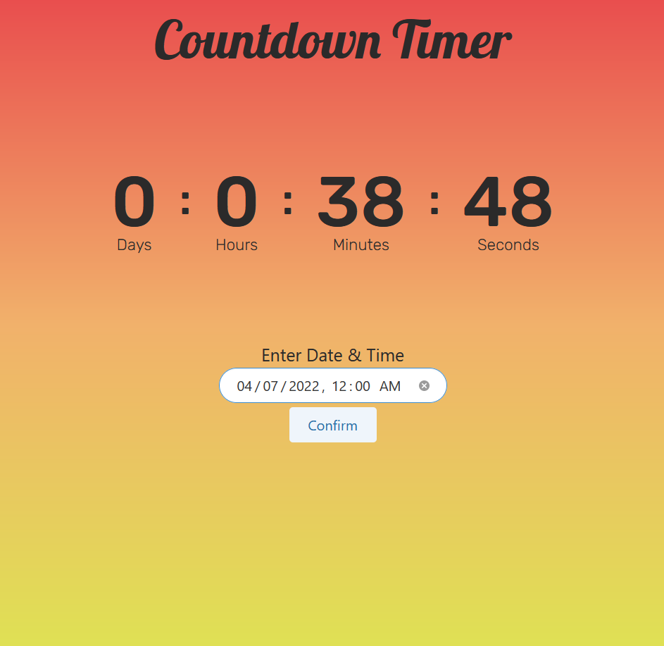

# A Simple Count Down Timer Webpage

</img>

## How to Use this Timer: 
- Use `git clone https://github.com/Reubzz/countdown-timer -b master`
- Run `index.html` 
- Enter any Date and Time in the Input field and click `Confirm` 

Written Using HTML, CSS and Main functions using Javascript. 